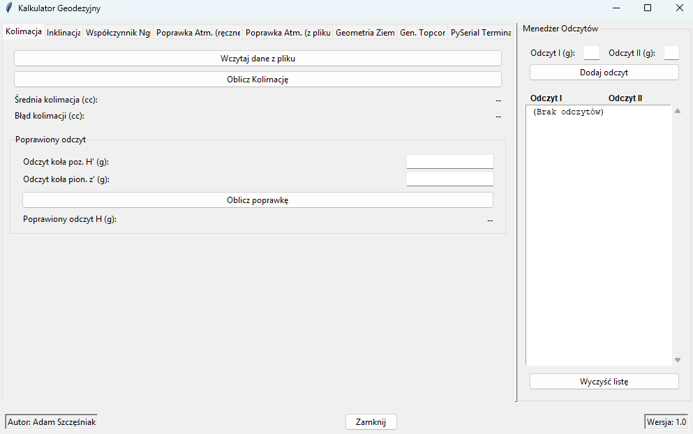
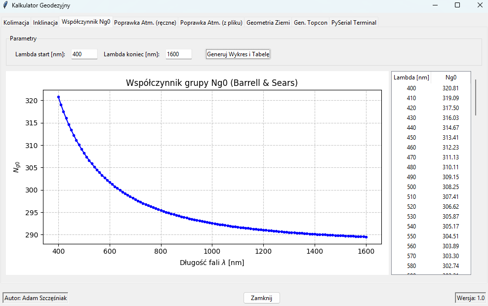
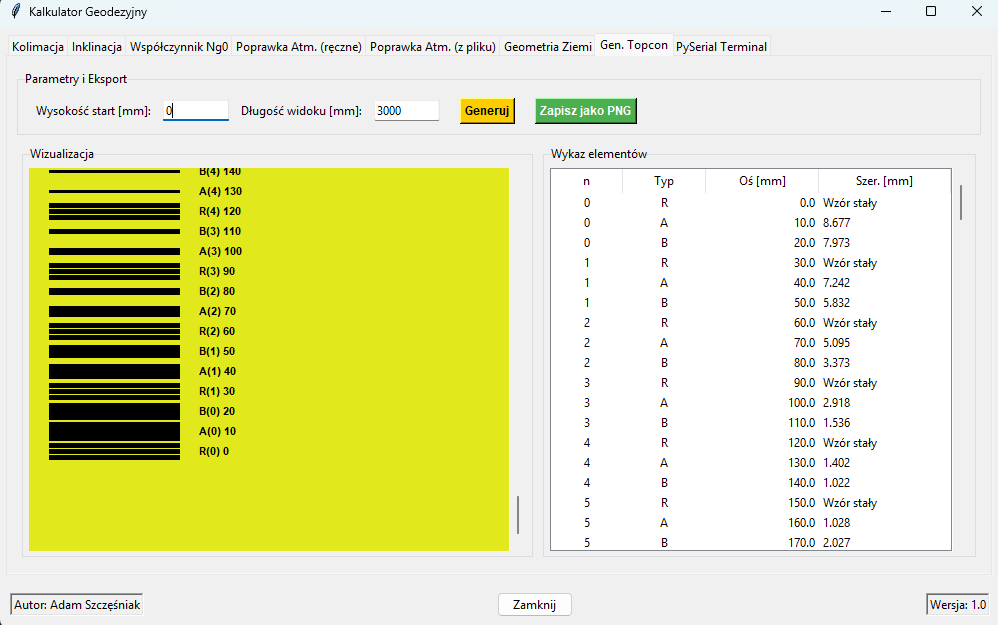

# Kalkulator Geodezyjny z Terminalem Serial

Aplikacja desktopowa napisana w Pythonie (Tkinter) przeznaczona do wykonywania specjalistycznych obliczeń geodezyjnych oraz komunikacji z instrumentami pomiarowymi.

<table>
  <tr>
    <td align="center"><b>Menu Główne & Obliczenia</b></td>
    <td align="center"><b>Wykresy i Analizy</b></td>
    <td align="center"><b>Terminal Serial</b></td>
  </tr>
  <tr>
    <td></td>
    <td></td>
    <td></td>
  </tr>
</table>

## 🚀 Funkcje aplikacji

* **Kolimacja i Inklinacja:** Obliczanie średniej kolimacji, inklinacji, błędów poprawek oraz wprowadzanie poprawek do odczytów koła poziomego.
* **Współczynnik Ng0:** Generowanie wykresów i tabel współczynnika grupy na podstawie wzoru Barrella i Searsa.
* **Poprawki Atmosferyczne:** Ręczne oraz wsadowe (z plików TXT/CSV) obliczanie poprawek meteorologicznych (wzór psychrometryczny Sprunga).
* **Geometria Ziemi:** Analiza różnic między długością łuku a cięciwą z uwzględnieniem krzywizny Ziemi.
* **Generator RAB-Code:** Wizualizacja i generowanie elementów łat kodowych Topcon (kod RAB).
* **PySerial Terminal:** Wbudowany terminal szeregowy do bezpośredniej komunikacji z instrumentami (np. przez Bluetooth/COM).

## 📁 Struktura projektu

* `src/` - Kod źródłowy aplikacji.
* `data_examples/` - Przykładowe pliki tekstowe do przetestowania funkcji wczytywania danych (kolimacja, inklinacja, przetwarzanie wsadowe) oraz wyniki (wygenerowana przez program łata topcon).

## 🛠️ Instalacja i uruchomienie (Dla deweloperów)

1. Sklonuj repozytorium:
   ```bash
   git clone [https://github.com/TWOJ-LOGIN/kalkulator-geodezyjny.git](https://github.com/Szczoopak/kalkulator-geodezyjny.git)
